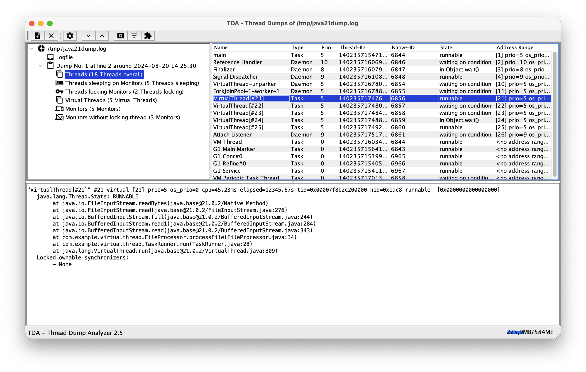

# TDA - Thread Dump Analyzer
[](https://github.com/irockel/tda/actions/workflows/build.yml)

TDA (Thread Dump Analyzer) for Java is a powerful yet lightweight Swing GUI for analyzing Thread Dumps and Heap 
Information generated by the Java VM. It is designed to assist in diagnosing performance issues, deadlocks, and 
memory problems in Java applications.

TDA supports Java 1.4.x through Java 21+, including specialized support for **Virtual Threads** (Java 19+).

## 🚀 Key Features

*   **Comprehensive Thread Dump Parsing**: Parse multiple thread dumps from log files and display them in an intuitive tree structure.
*   **Virtual Threads Support**: Analyze virtual thread states, pinning issues, and carrier thread relationships.
*   **Statistical Analysis**: Detailed statistics about thread states, monitors, and waiting/locking threads.
*   **Long-Running Thread Detection**: Identify threads that persist across multiple dumps, helping find "hung" or inefficient code.
*   **Deadlock Detection**: Automatic identification of deadlocks with detailed monitor information.
*   **Class Histogram Analysis**: Integrated analysis of heap objects (via `-XX:+PrintClassHistogram`).
*   **Flexible Filtering & Categorization**: Use custom filters and categories to manage large numbers of threads.
*   **Session Management**: Save and reopen analysis sessions.

---

## 🛠 Usage Modes

TDA can be used in four different ways to suit your environment:

### 1. Standalone Application
The most common way to use TDA for offline analysis of production log files.

**How to run:**
```bash
java -Xmx512m -jar tda.jar
```
Once opened, you can add log files containing thread dumps. TDA will parse them and display them in the tree view. If you
have several or big log files, you might need to adjust the memory allocation by increasing the `-Xmx` flag.

<div style="text-align: center;"></div>

#### Important Features:
*   **Thread Dump Tree**: Navigate through all detected dumps in a log file.
*   **Regular Expression for Timestamps**: Since thread dumps often lack timestamps, you can provide a regex to correlate dumps with log entries.
*   **Find Long Running Threads**: Compare consecutive dumps to see which threads haven't moved.
*   **Filters & Categories**: Group threads by name or state to reduce noise.
*   **Monitors & Deadlocks**: Detailed view of monitor usage and automatic deadlock detection.

### 2. JConsole Plugin
Analyze a running application directly within JConsole. This is particularly useful for production environments where 
you need to quickly inspect the state of a live system.

**How to use:**
Start JConsole with the TDA plugin:
```bash
jconsole -pluginpath tda.jar
```
A new "Thread Dumps" tab will appear. From here, you can:
*   **Request Thread Dumps**: Generate fresh dumps directly from the connected JVM.
*   **Analyze in Real-time**: Use all of TDA's parsing and analysis features on the live data.

### 3. VisualVM Plugin
TDA is also available as a plugin for VisualVM. You can install it directly from the **VisualVM Plugin Center**. 
It provides the same powerful analysis tools integrated into your VisualVM workflow.

### 4. MCP Server (Headless Analysis)
For integration with AI tools (like Cursor, Junie, or Claude Desktop) or automated pipelines, 
TDA can run as a **Model Context Protocol (MCP)** server. This allows for headless analysis of thread dumps using 
AI assistance.

#### How to run:
```bash
java -Djava.awt.headless=true -jar tda.jar --mcp
```

#### Integration Example (Junie/Cursor):
```json
{
  "mcpServers": {
    "tda": {
      "command": "java",
      "args": ["-Djava.awt.headless=true", "-jar", "path/to/tda.jar", "--mcp"]
    }
  }
}
```

#### Available Tools

The MCP server exposes the following tools:

| Tool | Arguments | Description |
| :--- | :--- | :--- |
| `parse_log` | `path` (string, required) | Parses a log file containing Java thread dumps. This must be the first action for a log file. |
| `get_summary` | None | Returns a summary of all parsed thread dumps (index, name, timestamp, thread/deadlock counts). |
| `check_deadlocks` | None | Checks for and returns information about any deadlocks detected in the parsed thread dumps. |
| `find_long_running` | None | Identifies threads that remain in the same state/stack trace across consecutive dumps. |
| `clear` | None | Resets the server state and clears the internal thread store for a new log file. |

#### Troubleshooting

- **Path issues**: Ensure you use absolute paths for the JAR file and the log files you want to parse.
- **Headless mode**: If you see errors related to `java.awt.HeadlessException`, double-check that `-Djava.awt.headless=true` is set.
- **Permissions**: Make sure the user running the MCP server has read permissions for the log files.
---

## 🏗 Building from Source

TDA is built using Maven. It requires **Java 11** or higher to build and run.

```bash
mvn clean package
```
This will build all components:
*   The standalone TDA JAR (in `tda/target/tda-x.x.jar`).
*   The VisualVM plugins as NBM files (in the `target/` directory of each `visualvm-*` module).

The resulting standalone JAR will also be located in the `tda/target/` directory.

---

## 📜 License
TDA is licensed under the **Lesser GNU General Public License (LGPL)**.

---
*For more detailed information, please refer to the internal documentation or the source code.*

